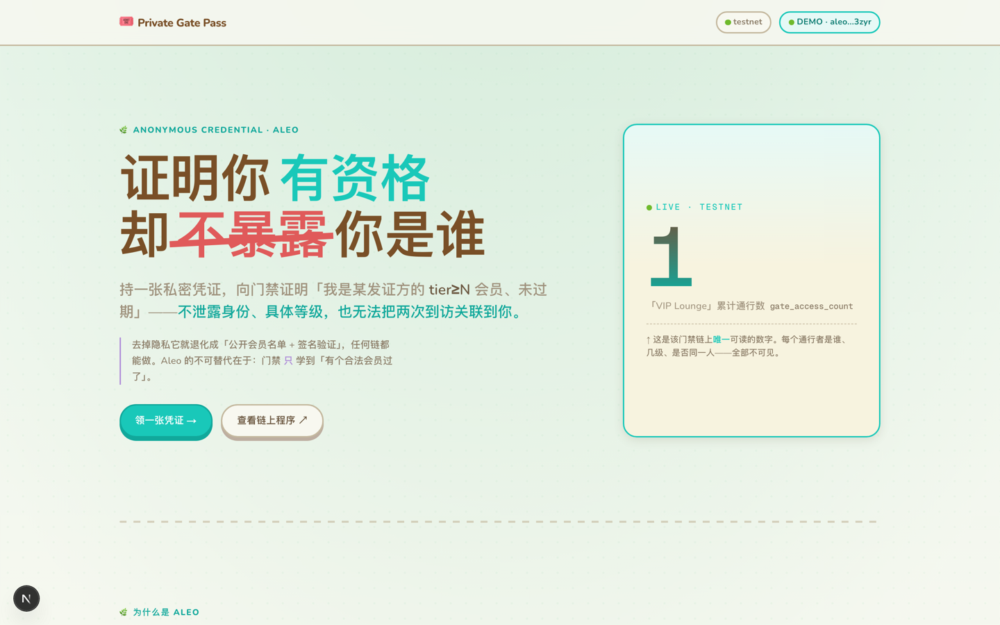
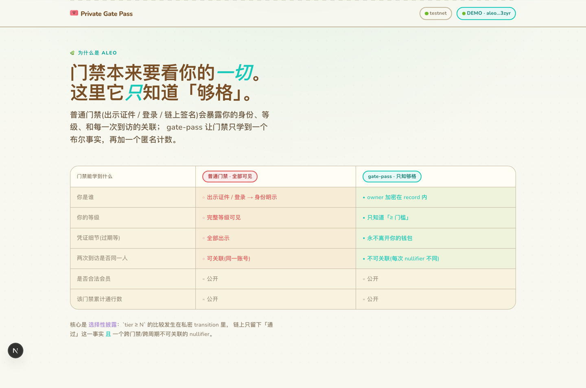
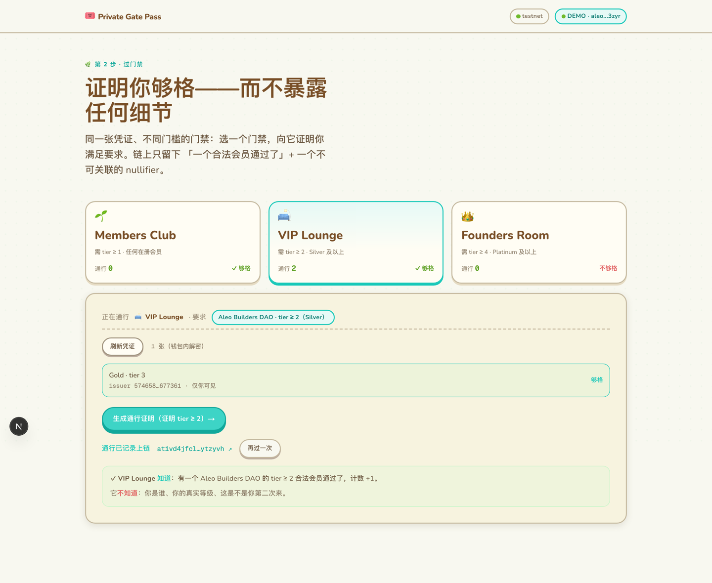

# Task 3 · Private Gate Pass —— 匿名凭证 / 选择性披露门禁

> 基于 Leo + 前端的可交互隐私 dApp。
> **一句话**：持一张私密会员凭证，向门禁证明「我是某发证方的 `tier ≥ N` 会员、未过期」——
> 而**不暴露**你是谁、具体几级、或两次到访是不是同一人。

**提交人**：`0xE1337` ｜ **地址** `aleo1ntxq2hsvnh4s5rmh23z2hvdlkd5j97mrxpjutk0ze6nys7ll25zquq3zyr`
**链上程序**：[`private_gate_pass.aleo`](https://explorer.provable.com/program/private_gate_pass.aleo?network=testnet) · Aleo testnet（已部署 + 真实执行验证）



---

## 一、它解决什么 & 为什么隐私是刚需

「凭资格进入」——会员制活动、白名单、token-gated 社区——传统做法要么出示证件、要么登录、
要么链上签名，**都会暴露**你的身份、完整等级、凭证细节，以及每一次到访的关联。

把它搬到透明链上也救不了：即使凭证哈希化，链上仍暴露
**谁（地址）、几次、是否同一人、和你其他链上活动的关联** = 你的行为指纹。

**去掉隐私，这个应用就退化成「公开会员名单 + 签名验证」——任何链都能做得更好。**
所以隐私不是加分项，而是它存在的前提。

### 为什么是 Aleo

| 门禁能学到什么 | 普通门禁 | gate-pass |
|---|---|---|
| 你是谁 | 身份明示 | owner 加密在 record 内 |
| 你的等级 | 完整可见 | **只知道「≥ 门槛」** |
| 凭证细节（过期等） | 全部出示 | 永不离开你的钱包 |
| 两次到访是否同一人 | 可关联 | 不可关联（每次 nullifier 不同） |
| 是否合法会员 / 累计通行数 | 公开 | 公开（唯一公开项） |

- **以太坊**：可编程但无隐私——门禁能验签，却把你的地址/等级/到访次数全暴露。
- **Zcash**：有隐私但不可编程，做不了 `tier ≥ N` 这种带逻辑的选择性披露。
- **Aleo**：record 模型把 owner / 凭证内容 / 关联性全藏，只公开一个匿名计数；
  再加原生 ZK 的**选择性披露**（证明性质而不暴露具体值）。隐私**且**可编程。



---

## 二、交互流程（demo）

**第 1 步：把私密凭证签发到钱包** —— 凭证以加密 record 形式存在，只有你能解密。

**第 2 步：过门禁** —— 选一张凭证，证明 `tier ≥ 2`。链上只留下「一个合法会员通过了」+
一个不可关联的 nullifier。门禁**没学到**你是谁、真实等级、或这是不是你第二次来：



---

## 三、合约（Leo 4.0.2，见 `leo/src/main.leo`）

```
record Credential { owner, issuer: field, tier: u8, expiry: u32, secret: field }  // 私密，加密给持有者
struct NullifierPreimage { secret: field, gate_id: field, epoch: u32 }            // 抗碰撞组合子
mapping spent_nullifiers: field => bool      // 公开：已花费 nullifier（防重复刷）
mapping gate_access_count: field => u64      // 公开：每个门禁的累计通行数

fn issue(holder, issuer, tier, expiry, secret) -> Credential
fn prove_access(cred, issuer_req, min_tier, gate_id, epoch) -> (Credential, Final)
```

`prove_access` 三个要点：

1. **选择性披露**：在私密 transition 里断言 `issuer == issuer_req`、`tier >= min_tier`、
   `expiry >= epoch`——链上只看到「通过/不通过」，看不到具体值。
2. **nullifier**：在**链上**用 `BHP256::hash_to_field(NullifierPreimage{secret, gate_id, epoch})`
   派生。secret 是私密 record 字段，所以浏览器**不需要复现任何链上哈希**（无 WASM）。
   同凭证+同门禁+同 epoch → 同 nullifier → **防重复刷**；换门禁/换周期 → 不同 nullifier → **不可关联**。
3. **重新产出凭证**给持有者（不销毁），并在 `final{}` 里记录 nullifier + 累加公开计数。

---

## 四、真实执行路径（链上证据，可独立复核）

> 题目强调「真实执行路径，不是浏览器里假算」。下面每一笔都在 **Aleo testnet** 上确认。

| 操作 | Transaction ID |
|---|---|
| 部署 | `at13rsq5p8e4w6kyq86f54yx53apjmmym2682cuq2qryqttz77w6gyqe0r68d` |
| `issue`（签发 Gold 凭证，发证方 = "Aleo Builders DAO"） | `at1gvl4kvsfl5ysvyp6yxh2yqsdadvcr4y9v25ehggksjut0v7xtvyqqq9xqr` |
| `prove_access`（过 "VIP Lounge" 门禁，证明 tier ≥ 2） | `at1vd4jfcl3p6l7vcnfex2fy2q6wvx8r7dwd5pjm3hp3r4rklj6pczsytzyvh` |

```bash
# 程序源码在链上
curl -s https://api.provable.com/v2/testnet/program/private_gate_pass.aleo

# "VIP Lounge" 门禁累计通行数：prove_access 后 null -> 1（也是前端 Hero 实时读的那个数）
curl -s https://api.provable.com/v2/testnet/program/private_gate_pass.aleo/mapping/gate_access_count/115482402605128702247352604933780178879204752660839134036984060969250666327field
# => "1u64"
```

`leo run` 还逐项验证了逻辑：tier 不足 / issuer 不符 / 已过期 → 正确 revert；
nullifier 在「同输入→同值、换门禁/周期→不同值」上确定且不可关联。详见 `leo/DEPLOYMENT.md`。

---

## 五、前端（`web/`）

- **Next.js 16 (App Router) + TypeScript**，手写 CSS 设计系统——**《集合啦！动物森友会》风**的温暖岛屿
  设计（暖羊皮纸 + 岛屿绿 + 圆角药丸按钮 + 任天堂「按压」3D 阴影），非 Tailwind 模板。
- **多门禁**：Members Club / VIP Lounge / Founders Room 三个不同 tier 门槛的门禁——同一张
  Gold(tier 3) 凭证够格进前两个、进不了 Founders(需 tier 4)，直观演示选择性披露的 `tier ≥ N`。
- 每个门禁的累计通行数都**实时从链上读**（`api.provable.com/v2/testnet`，无需钱包）。
- 浏览器只用原生 Web Crypto 把名字映射成 `field`、生成随机 secret——**无 WASM / SDK**。
- 也接了 `@provablehq/aleo-wallet-adaptor`（Shield/Puzzle/Leo/Fox）；`requestRecords` 钱包内解密读取私密凭证实测可用。

截图见 `screenshots/`：`01-hero` · `02-compare` · `03-issue` · `04-gate`（三门禁 + 揭示框）· `06-hero-mobile`。

---

## 六、诚实标注（不吹）

1. **发证未做访问控制**：本 demo 任何人可 `issue`（自发自持）；真实场景应 `assert` 签发者属于
   授权发证方。选择性披露 / 不可关联性不依赖这一点。
2. **状态级 ≠ 网络级匿名**：提供地址↔凭证的状态级不可关联；fee 付费方、交易时序、IP 仍可被相关。
3. **UI 走 DEMO_MODE**：本机实测中，当前 alpha 钱包适配器（`@provablehq/aleo-wallet-adaptor@0.3.0-alpha.4`）
   的浏览器**广播**对着 testnet RPC 不稳定（`executeTransaction` 返回临时 id 但常因基建抖动不落链，
   CLI 也需多次重试）。为保证可演示，前端默认 `NEXT_PUBLIC_DEMO_MODE=true`（桩签名 + 固定凭证），
   而**真实执行路径由上面那几笔 CLI 链上 tx 证明**，且 demo 里的「VIP Lounge」计数读的就是真链数据 = 1。

---

## 七、运行

```bash
# 合约
cd leo && leo build
leo run issue <holder> <issuer>field <tier>u8 <expiry>u32 <secret>field

# 前端（默认 DEMO_MODE，无需钱包即可走完整流程）
cd web && npm install --legacy-peer-deps && npm run dev   # http://localhost:3000
```

```
task3/
├── task3.md          ← 本文档
├── leo/              private_gate_pass.aleo（program.json · src/main.leo · DEPLOYMENT.md）
├── web/              Next.js 前端（不含 node_modules）
└── screenshots/      01..06
```
