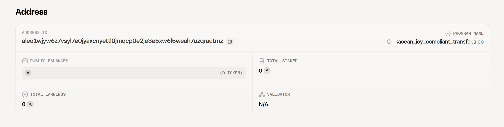
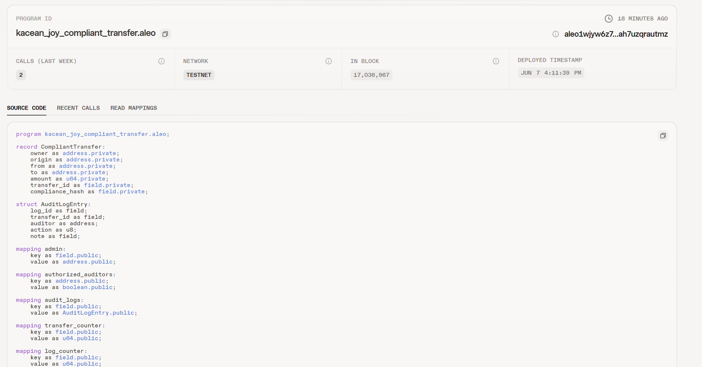
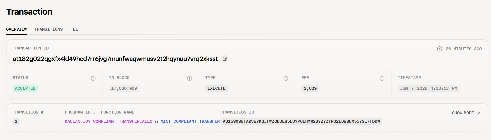

# Task 4 - 用起来：真实场景落地 

将你的 Aleo 应用部署到测试网并完成一次链上交互，提交相关代码，测试网合约地址和链上交互截图。

1. [源码](./resource/task-4/kacean_joy_compliant_transfer_clean/src/main.leo)
2. 合约地址:`aleo1wjyw6z7vsyl7e0jyaxcnyettl0jmqcp0e2je3e5xw6l5weah7uzqrautmz`
3. 合约截图

3. 链上交易地址
* `at182g022qgxfx4ld49hcd7rr6jvg7munfwaqwmusv2t2hqynuu7vrq2xksst`
* `at1aaylx3hhlnxnh24tva4vye9p0nqp7nv6rm6kwxcmyyuax5pj8yrqfnmc0p`
4. 交易截图

