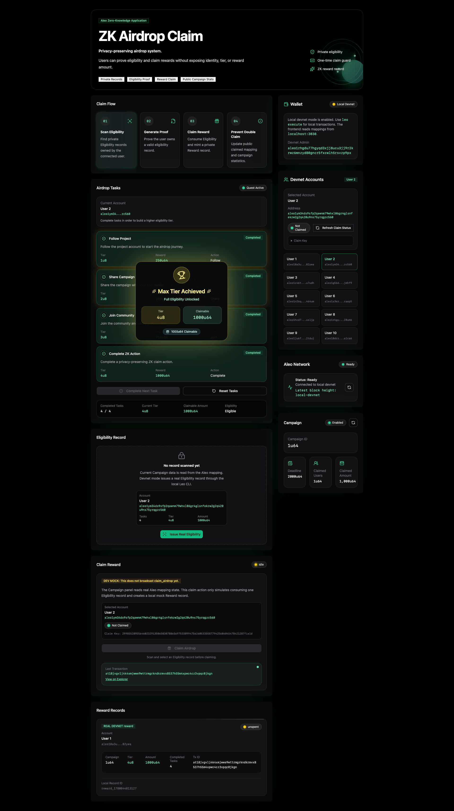
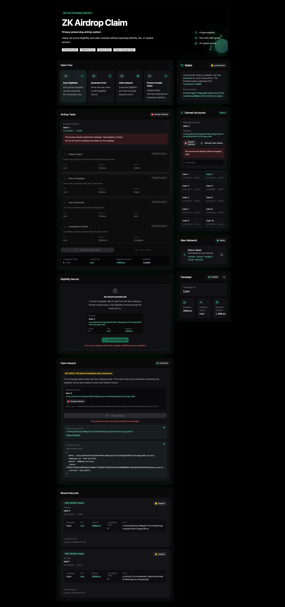
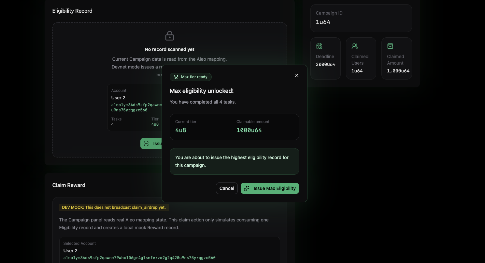
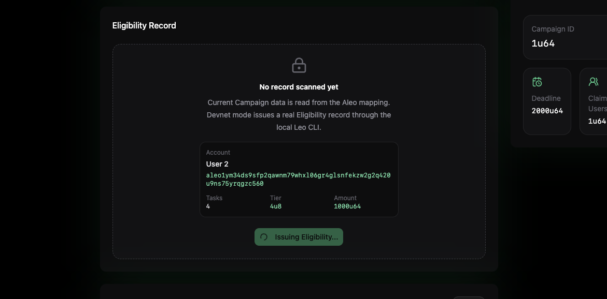
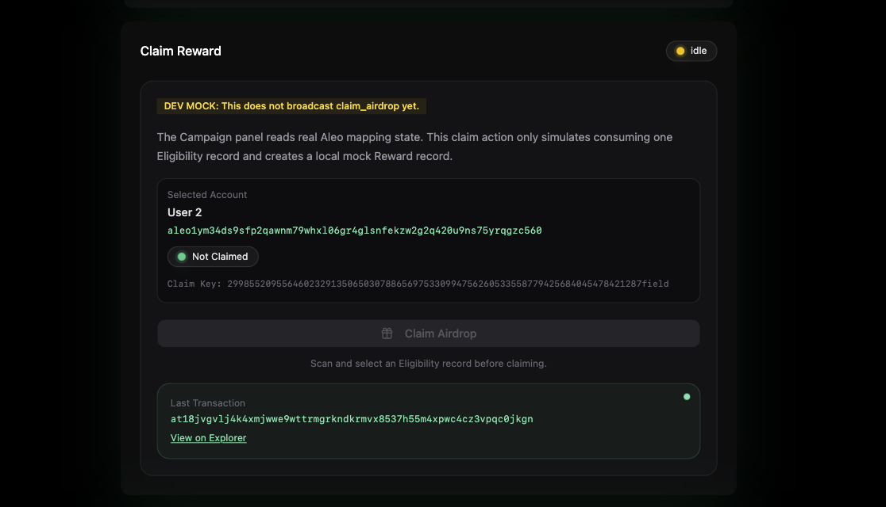
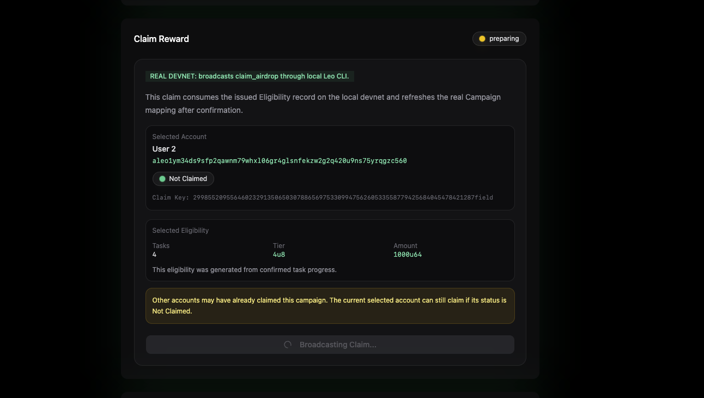
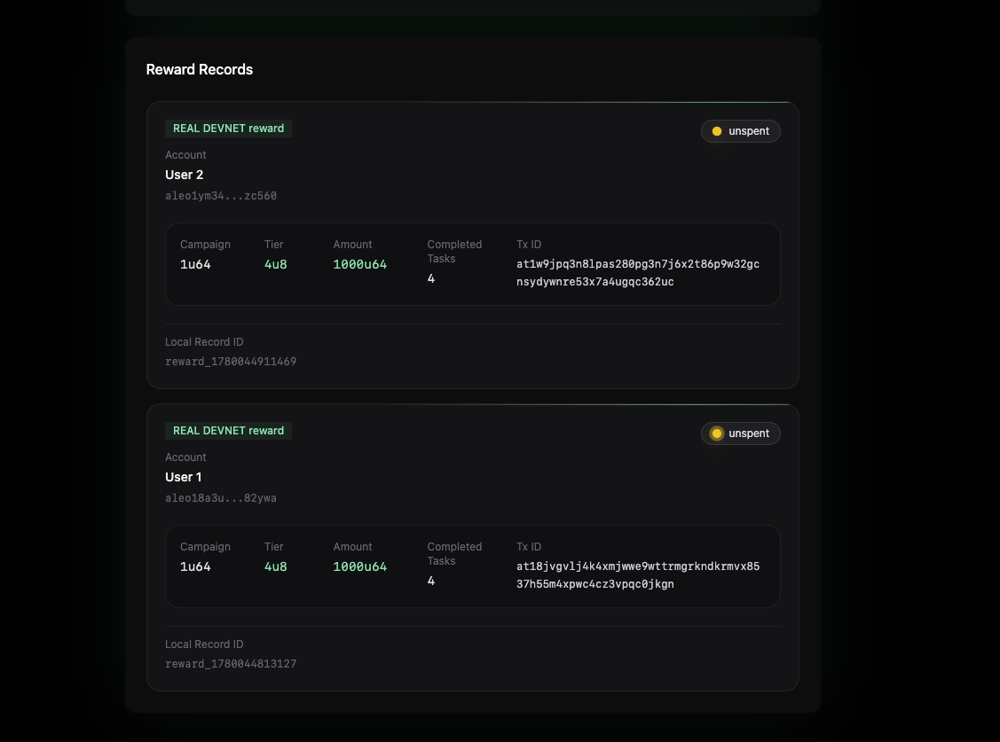

# ZK Airdrop Claim

一个基于 **Aleo** 的隐私保护空投领取 Demo。

用户可以在不公开身份、等级和奖励金额的情况下，证明自己具备领取资格并领取奖励。

这个项目演示了一套完整的本地 devnet 零知识空投流程：

- 通过任务进度生成不同等级的领取资格；
- 在签发资格前预确认用户当前 tier 和 claimable amount；
- 签发私有 `Eligibility` 资格记录；
- 领取私有 `Reward` 奖励记录；
- 通过公开 mapping 防止重复领取；
- 从 Aleo mapping 读取真实 campaign 状态；
- 切换多个本地 devnet 测试账户，验证“每个用户每个 campaign 只能领取一次”。

<p align="center">
  
  

</p>
<p align="center">
  
  
</p>

<p align="center">
  
  
</p>

<p align="center">
  
</p>

---

## 项目概览

`ZK Airdrop Claim` 是一个面向黑客松展示的隐私空投系统 Demo。

在传统空投中，领取名单、用户等级和奖励金额通常是公开的，或者很容易被推断出来。本项目探索了一种更隐私的设计：

1. 管理员创建一个公开 campaign。
2. 用户在前端完成空投任务，形成当前任务进度、tier 和 claimable amount。
3. 用户点击资格验证前，前端先弹窗预确认当前领取等级和可领取金额，避免用户在未完成全部任务时误领。
4. 管理员根据当前任务进度给用户签发一个私有 `Eligibility` record。
5. 用户消耗这个 `Eligibility` record，领取一个私有 `Reward` record。
6. 合约只公开记录 campaign 统计数据和用户是否已领取。
7. 用户等级和奖励金额保留在 Aleo 私有 records 中。

本地 Demo 还支持多个 devnet 账户切换，方便验证：

- 同一个用户不能重复领取同一个 campaign；
- 不同用户可以各自领取一次；
- 每次领取成功后，campaign 统计数据会真实更新。

---

## 核心功能

- **空投任务与等级资格**
  用户按顺序完成空投任务，不同任务进度会对应不同的 tier 和 claimable amount。资格签发前会先确认当前奖励等级，避免用户误以较低等级领取。

- **资格验证前置确认**
  原本的“未完成全部任务提醒”逻辑已经前移到资格验证阶段。用户在签发 `Eligibility` 前会先看到当前完成任务数、当前 tier 和可领取金额；确认后才会真正调用本地 devnet API 签发资格记录。

- **私有 Eligibility Record**
  用户收到一个包含 campaign id、tier、amount 和 deadline 的私有资格记录。

- **私有 Reward Record**
  领取成功后生成一个私有奖励记录。

- **重复领取保护**
  合约使用公开的 `claimed` mapping，防止同一个账户对同一个 campaign 重复领取。

- **公开 Campaign 统计**
  前端读取真实 Aleo mapping 数据，包括 campaign 状态、deadline、已领取用户数和已领取总金额。

- **本地 Devnet 集成**
  应用通过 Next.js API Routes 调用本机 Leo CLI，在本地 Aleo devnet 上真实执行合约。

- **多账户 Devnet Demo**
  前端支持切换多个本地 devnet 测试账户，并自动检测当前账户是否已经领取。

- **账户领取状态指示**
  切换账户后，前端会自动读取该账户是否已经领取过当前 campaign。已领取账户会锁定任务进度、禁止再次签发资格和领取奖励。

- **动画前端界面**
  使用 Framer Motion 和 Tailwind CSS 打磨展示效果，适合黑客松演示。

---

## 技术栈

### 智能合约

- Aleo
- Leo
- Local Aleo devnet
- snarkOS

### 前端

- Next.js 14
- React 18
- TypeScript
- Tailwind CSS
- Zustand
- Framer Motion
- lucide-react
- shadcn/ui 风格组件

### 本地集成

- Next.js API Routes
- Leo CLI
- Aleo local devnet REST API
- 本地 devnet 多账户测试

---

## 项目结构

```txt
zk-airdrop-claim/
  frontend/
    src/
      app/
      components/
      config/
      constants/
      services/
      stores/
      types/
  programs/
    zk_airdrop_claim/
      src/
      build/
  scripts/
  package.json
  README.md
```

重要目录：

- `programs/zk_airdrop_claim`：Leo 智能合约源码。
- `frontend`：Next.js 前端应用。
- `scripts`：本地开发辅助脚本，包括 devnet 用户充值脚本。

---

## 环境准备

请先安装：

- Node.js
- npm
- Leo CLI
- snarkOS，或者允许 `leo devnet --install` 自动安装
- Git

检查 Leo：

```bash
leo --version
```

检查 Node：

```bash
node -v
npm -v
```

---

## 快速开始

### 1. 克隆项目

```bash
git clone https://github.com/Maimai10808/zk-airdrop-claim.git
cd zk-airdrop-claim
```

### 2. 安装前端依赖

```bash
npm run frontend:install
```

### 3. 创建前端环境变量文件

创建文件：

```txt
frontend/.env.local
```

示例内容：

```env
NEXT_PUBLIC_ALEO_API_BASE_URL=http://localhost:3030
NEXT_PUBLIC_ALEO_NETWORK=testnet
NEXT_PUBLIC_ALEO_PROGRAM_ID=zk_airdrop_claim.aleo
NEXT_PUBLIC_ALEO_DEVNET=true

ALEO_DEVNET_ENDPOINT=http://localhost:3030
ALEO_DEVNET_NETWORK=testnet
ALEO_DEVNET_PRIVATE_KEY=APrivateKey1zkp8CZNn3yeCseEtxuVPbDCwSyhGW6yZKUYKfgXmcpoGPWH
ALEO_PROGRAM_PATH=/YOUR_LOCAL_PATH/zk-airdrop-claim/programs/zk_airdrop_claim
```

请把下面这一行替换成你本机的绝对路径：

```env
ALEO_PROGRAM_PATH=/YOUR_LOCAL_PATH/zk-airdrop-claim/programs/zk_airdrop_claim
```

例如：

```env
ALEO_PROGRAM_PATH=/Volumes/DevDisk/Dev/projects/Aleo-101-Bootcamp/zk-airdrop-claim/programs/zk_airdrop_claim
```

---

## 推荐完整启动流程

第一次或全新本地运行：

```bash
npm run devnet:start
```

然后在另一个终端运行：

```bash
npm run devnet:bootstrap
npm run devnet:fund-users
npm run frontend:dev
```

---

## 本地 Devnet 工作流

推荐使用多个终端运行。

### Terminal 1：启动本地 devnet

```bash
npm run devnet:start
```

保持这个终端运行，不要关闭。

如果还没有安装 snarkOS，可以运行：

```bash
npm run devnet:start:install
```

### Terminal 2：部署并初始化合约

```bash
npm run devnet:bootstrap
```

这个命令会：

1. 部署 `zk_airdrop_claim.aleo`；
2. 初始化 admin；
3. 创建默认 campaign `1u64`；
4. 查询 campaign mapping。

### Terminal 2：给本地测试用户充值

```bash
npm run devnet:fund-users
```

该命令会给 Demo 账户发送本地 devnet credits，让它们可以支付 claim 交易手续费。

### Terminal 3：启动前端

```bash
npm run frontend:dev
```

打开终端打印的地址，通常是：

```txt
http://localhost:3000
```

如果 3000 端口被占用，Next.js 可能会自动使用：

```txt
http://localhost:3001
```

---

## 重置本地 Devnet

如果你想清空本地链状态并从零开始：

```bash
npm run devnet:reset
```

然后重新运行：

```bash
npm run devnet:bootstrap
npm run devnet:fund-users
npm run frontend:dev
```

适合重置的情况：

- campaign 状态已经很旧；
- 多个用户已经领取过；
- 想从 0 开始重新演示完整流程；
- 清理本地 devnet 数据后，前端提示合约不存在。

---

## Demo 演示流程

前端启动后：

1. 选择一个 devnet 账户，例如 `User 1`。
2. 应用会自动检测该用户是否已经领取过 campaign `1u64`。
3. 如果该用户已经领取，任务进度、资格签发和 claim 都会被锁定。
4. 如果该用户还没有领取，先在 `Airdrop Tasks` 中按顺序完成任务。
5. 不同任务进度会生成不同的 tier 和 claimable amount，例如完成 1 个任务是较低奖励，完成全部任务是最高奖励。
6. 点击 `Issue Real Eligibility` 前，前端会先弹窗确认当前完成任务数、tier 和可领取金额。
7. 如果用户没有完成全部任务，弹窗会提醒该 campaign 只能领取一次，确认后才继续签发资格。
8. 确认后，后端使用 admin private key，给当前选中用户签发私有 `Eligibility` record。
9. 签发成功后，页面会显示该账户当前可以领取的金额。
10. 点击 `Claim on Local Devnet`。
11. 后端使用当前选中用户的 private key 执行 `claim_airdrop`。
12. 应用展示生成的私有 `Reward` record。
13. Campaign 统计数据和当前账户 claim status 自动刷新。
14. 切换到 `User 2` 并重复流程。
15. 再切回 `User 1`，应用应显示 `Already Claimed`，并禁止再次领取。

预期 campaign 统计：

```txt
初始状态：
Claimed Users: 0u64
Claimed Amount: 0u64

User 1 领取后：
Claimed Users: 1u64
Claimed Amount: 1000u64

User 2 领取后：
Claimed Users: 2u64
Claimed Amount: 2000u64
```

这证明每个账户只能领取一次，但不同账户可以各自独立领取。

任务奖励等级示例：

```txt
完成 0 个任务：不可领取
完成 1 个任务：Tier 1，Claimable Amount 250u64
完成 2 个任务：Tier 2，Claimable Amount 500u64
完成 3 个任务：Tier 3，Claimable Amount 750u64
完成 4 个任务：Tier 4，Claimable Amount 1000u64
```

注意：每个账户每个 campaign 只能领取一次。如果用户只完成了部分任务就确认签发资格并领取，后续不能再补领差额。

---

## 常用命令

### 本地 devnet 命令

启动本地 devnet：

```bash
npm run devnet:start
```

启动本地 devnet，并在需要时安装 snarkOS：

```bash
npm run devnet:start:install
```

停止本地 devnet：

```bash
npm run devnet:stop
```

重置本地 devnet：

```bash
npm run devnet:reset
```

检查本地 devnet：

```bash
npm run devnet:check
```

部署并初始化合约：

```bash
npm run devnet:bootstrap
```

给本地测试用户充值：

```bash
npm run devnet:fund-users
```

### 前端命令

安装前端依赖：

```bash
npm run frontend:install
```

启动前端开发服务器：

```bash
npm run frontend:dev
```

构建前端：

```bash
npm run frontend:build
```

别名：

```bash
npm run app:dev
npm run app:build
```

### Leo 合约命令

构建 Leo program：

```bash
npm run leo:build
```

运行 Leo tests：

```bash
npm run leo:test
```

部署到本地 devnet：

```bash
npm run leo:deploy:devnet
```

初始化 admin：

```bash
npm run leo:init-admin
```

创建默认 campaign：

```bash
npm run leo:create-campaign
```

查询 admin mapping：

```bash
npm run leo:query-admin
```

查询 campaign mapping：

```bash
npm run leo:query-campaign
```

---

## 本地 Devnet 账户

项目内置了多个本地 devnet 账户用于 Demo。

这些账户只用于本地开发，不要用于 mainnet、公共 testnet 或真实资产。

前端只能读取：

- `id`
- `label`
- `address`

private key 保存在 server-only 配置中，只会被本地 API routes 用于调用 Leo CLI。

---

## Claim Status 工作原理

前端会检测当前选中账户是否已经领取过当前 campaign。

合约把领取状态记录在公开的 `claimed` mapping 中。claim key 来自：

```txt
selected account address + campaign id
```

服务端会按合约逻辑计算 claim key：

1. 把 selected account address cast 成 `field`；
2. 把 campaign id cast 成 `field`；
3. 将两个 `field` 相加；
4. 使用结果查询 `claimed[claimKey]`。

当当前账户已经领取：

- UI 显示 `Already Claimed`；
- 禁止签发新的 eligibility；
- 禁止再次 claim。

当当前账户还没有领取：

- UI 显示 `Not Claimed`；
- 允许签发 eligibility；
- 允许 claim。

这样在切换不同账户时，可以立刻看到谁还能领取、谁已经领取过。

---

## Task Eligibility 工作原理

前端内置了一组空投任务，用于模拟真实空投中的社交任务、社区任务或链上任务。

用户完成任务后，前端会根据任务进度计算：

- completed task count；
- eligibility tier；
- claimable amount；
- 是否已经具备领取资格。

资格验证逻辑发生在 `Issue Real Eligibility` 之前：

1. 如果当前账户已经领取过当前 campaign，任务进度会锁定，并禁止再次签发资格。
2. 如果当前账户还没有完成任何任务，不能签发资格。
3. 如果当前账户只完成了部分任务，前端会先提示“只能领取一次”，用户确认后才继续签发资格。
4. 如果当前账户完成了全部任务，前端会展示最高 tier 和最高可领取金额，再继续签发资格。
5. 签发成功后，`Eligibility` record 会携带当前 tier 和 amount。
6. claim 时，合约会消耗这个 `Eligibility` record 并生成对应金额的 `Reward` record。

这样可以把“任务进度 → 领取资格 → 私有奖励记录”的逻辑串起来，同时避免用户在 claim 阶段才发现自己领取等级较低。

---

## 重要说明

### 1. 本地 devnet 状态不是永久的

本地 devnet 会生成类似下面的目录或文件：

```txt
node-0/
node-1/
node-data-0/
node-data-1/
snarkos
```

这些文件应该被 Git 忽略，不应提交。

### 2. reset 后需要重新部署合约

运行：

```bash
npm run devnet:reset
```

之后必须运行：

```bash
npm run devnet:bootstrap
```

否则前端可能会提示 `zk_airdrop_claim.aleo` 不存在。

### 3. reset 后需要重新给用户充值

本地 devnet reset 后，测试用户可能会失去 public credits。

请在测试多账户领取前运行：

```bash
npm run devnet:fund-users
```

### 4. 每个用户每个 campaign 只能领取一次

如果当前选中账户已经领取过 campaign `1u64`，应用会禁止再次 issue 和 claim。

如果想从零重新测试，请 reset 本地 devnet。

### 5. 未完成全部任务也可以领取，但只能领取一次

任务进度会影响 `Eligibility` 中的 tier 和 amount。

如果用户只完成了 1、2 或 3 个任务，也可以在确认弹窗后签发资格并领取对应等级奖励。但领取成功后，该账户对当前 campaign 会被标记为已领取，不能再通过完成后续任务补领更高金额。

因此演示时建议先完成全部任务，再签发资格和领取最高奖励。

---

## Git Ignore 规则

以下本地文件不应该提交：

```txt
node_modules/
frontend/node_modules/
frontend/.next/
node-*/
node-data-*/
validator-*/
client-*/
snarkos
*.log
.env
.env.local
frontend/.env.local
```

提交前检查：

```bash
git status --short
```

干净的提交不应该包含本地 devnet 数据、日志、构建缓存或环境变量文件。

---

## 黑客松总结

这个项目展示了 Aleo 如何用于构建隐私保护空投系统：

- 任务进度可以映射成不同的 eligibility tier；
- eligibility 是私有的；
- reward amount 是私有的；
- claim 会生成私有 records；
- public mappings 只记录最小化的反作弊状态；
- 前端仍然可以展示有用的 campaign 统计；
- 本地 devnet 多账户测试可以验证重复领取保护；
- 资格验证前置确认可以减少误领，并让“任务进度 → 领取金额”的关系更清晰。

Demo 覆盖了从智能合约到前端交互的完整开发流程，包括本地 devnet 部署、多账户切换、任务等级资格、资格前置确认、真实 Leo CLI 执行和 Aleo mapping 读取。
