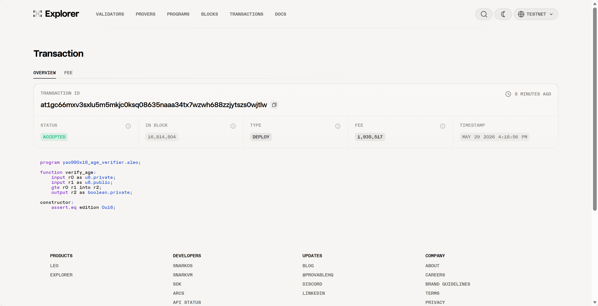
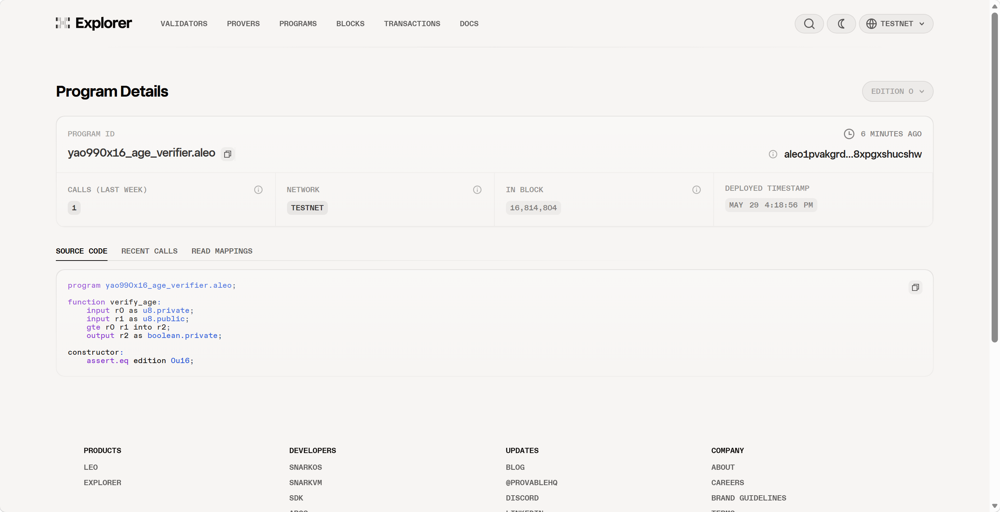
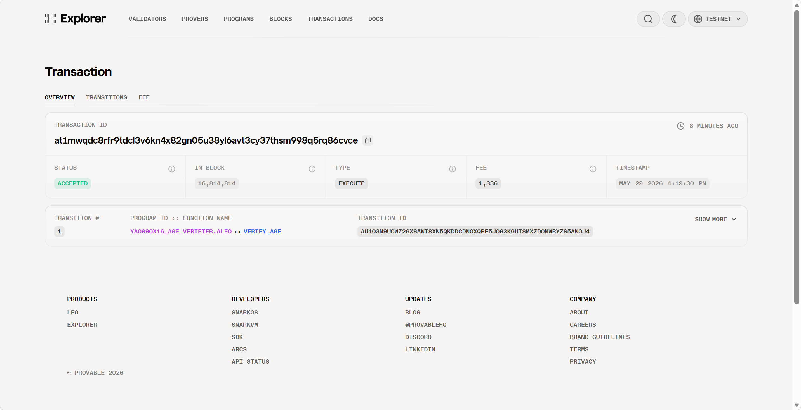
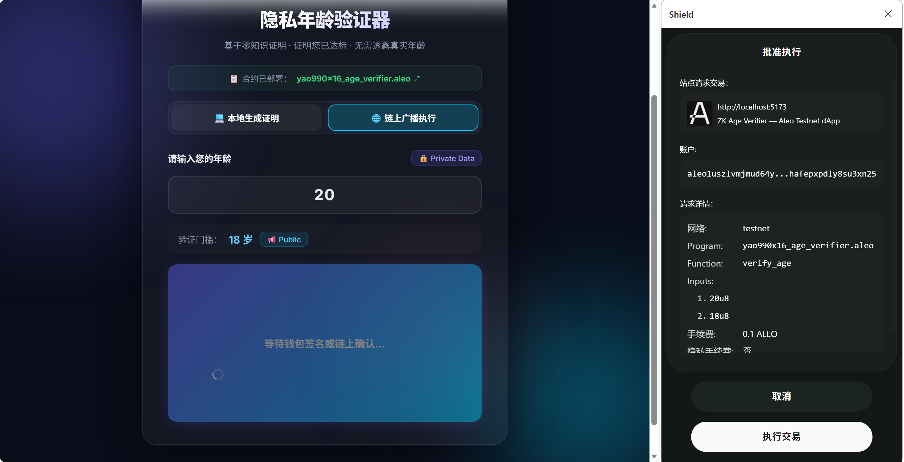

# Task 4 — ZK Age Verifier (Testnet 部署版)

> Aleo 101 Bootcamp · Task 4 · Author: **Yao990x16**

## 📋 任务目标

将 Aleo 隐私年龄验证器部署到测试网并完成链上交互。

## 🏗️ 项目概述

基于 Task 3 的零知识年龄验证器进行改进，升级 SDK、钱包适配器并部署到 Aleo Testnet。

**核心功能**：用户输入年龄（Private），合约比对门槛值（Public），只输出 `true/false`，真实年龄通过零知识证明被隐藏。

## 🔗 测试网合约信息

| 项目 | 值 |
|------|-----|
| **程序名** | `yao990x16_age_verifier.aleo` |
| **网络** | Aleo Testnet |
| **部署 TX ID** | `at1gc66mxv3sxlu5m5mkjc0ksq08635naaa34tx7wzwh688zzjytszs0wjtlw` |
| **执行 TX ID** | `at1mwqdc8rfr9tdcl3v6kn4x82gn05u38yl6avt3cy37thsm998q5rq86cvce` |
| **部署费用** | 1.935517 credits |
| **执行费用** | 0.001336 credits |
| **Explorer** | [查看合约 ↗](https://explorer.provable.com/program/yao990x16_age_verifier.aleo) |

## 📜 合约源码

```leo
// src/main.leo
program yao990x16_age_verifier.aleo {
    // 年龄验证函数
    // age: 用户真实年龄 (Private)
    // age_limit: 年龄门槛 (Public)
    // 返回: bool — 是否达标
    fn verify_age(age: u8, age_limit: u8) -> bool {
        return age >= age_limit;
    }
}
```

## 🔑 相比 Task 3 的改进

| 改进项 | Task 3 | Task 4 |
|--------|--------|--------|
| SDK | `@aleohq/sdk@0.6.0` | `@provablehq/sdk@0.10.5` |
| 钱包连接 | 无 | Shield + Leo Wallet |
| 部署环境 | 纯本地 | Testnet 部署 |
| Leo 版本 | 4.0.2 | 4.0.2 |
| 程序名 | `task3_age_verifier.aleo` | `yao990x16_age_verifier.aleo` |

## 🚀 链上交互记录

### 1. 部署合约

```bash
$ leo deploy --yes --broadcast

📦 Creating deployment transaction for 'yao990x16_age_verifier.aleo'...

📊 Deployment Summary
  Program Size:         0.21 KB / 500.00 KB
  Total Fee:            1.935517 credits

📡 Broadcasting deployment...
✉️ Transaction ID: at1gc66mxv3sxlu5m5mkjc0ksq08635naaa34tx7wzwh688zzjytszs0wjtlw
✅ Deployment confirmed!
```

#### 部署相关截图

- **测试网部署交易 (Provable Explorer)**:
  
- **测试网合约注册页面 (Provable Explorer)**:
  

### 2. 链上执行（verify_age: 25岁 ≥ 18岁）

```bash
$ leo execute verify_age 25u8 18u8 --yes --broadcast

⚙️ Executing yao990x16_age_verifier.aleo/verify_age...

📊 Execution Cost: 0.001336 credits
➡️  Output: true

📡 Broadcasting execution...
✉️ Transaction ID: at1mwqdc8rfr9tdcl3v6kn4x82gn05u38yl6avt3cy37thsm998q5rq86cvce
✅ Execution confirmed!
```

#### 执行相关截图

- **测试网链上交互交易 (Provable Explorer)**:
  

## 🖥️ 前端 Demo

前端使用 React + Vite，支持：

- **本地 ZK 证明执行**：浏览器内生成零知识证明
- **钱包连接**：Shield Wallet / Leo Wallet
- **合约信息展示**：链接到 Aleo Explorer

### 前端功能展示

- **钱包交互 (连接与授权)**:
  
- **链上验证成功 (DApp UI)**:
  

### 启动方式

```bash
cd frontend
npm install
npm run dev
# 访问 http://localhost:5173
```

## 📁 项目结构

```text
task4_age_verifier/
├── docs/                     # 任务文档与截图
│   └── pic/                  # 链上交互与部署截图
│       ├── Testnet合约截图.png
│       ├── Testnet执行TX截图.png
│       ├── Testnet部署TX截图.png
│       ├── 前端链上验证成功截图.png
│       └── 链上广播执行钱包交互截图.png
├── src/
│   └── main.leo              # Leo 合约源码
├── build/
│   └── main.aleo             # 编译后的 Aleo 指令
├── frontend/
│   ├── src/
│   │   ├── App.jsx           # 主应用组件
│   │   ├── App.css           # 样式
│   │   ├── WalletProvider.jsx # 钱包适配器
│   │   ├── main.jsx          # 入口
│   │   └── workers/
│   │       ├── worker.js     # Web Worker (本地 ZK 执行)
│   │       └── AleoWorker.js # Worker 代理
│   ├── helloworld/build/     # 前端引用的编译产物
│   ├── package.json
│   └── vite.config.js
├── program.json
├── .env                       # 网络 & 私钥配置
└── README.md
```
