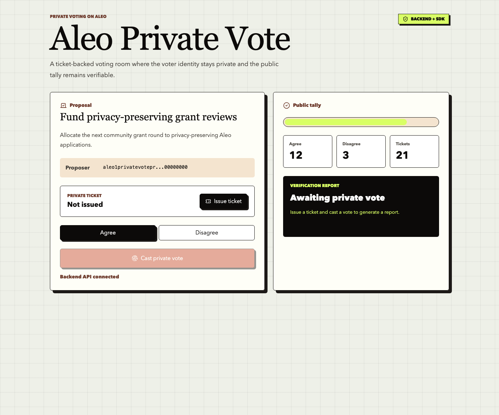

# Task 3 - 建起来：从程序到 dApp

## 项目

- 项目名称：Aleo Private Vote
- 项目类型：基于 Leo、TypeScript SDK、Rust snarkVM、后端 API 和 Next.js 前端的隐私投票 DApp
- 代码目录：`learn/qiaopengjun5162/task/aleo-private-vote`
- GitHub 仓库：https://github.com/qiaopengjun5162/aleo-private-vote

## 实现内容

- Leo 程序：`private_vote.aleo`
- 前端：Next.js + React + Tailwind CSS
- SDK：浏览器 Web Worker 中使用 `@provablehq/sdk` 本地执行验证
- 后端：Fastify API，提供提案、票据和验证报告接口
- 客户端：TypeScript SDK dry-run 和 Rust snarkVM dry-run / testnet execute

## 验证

- `just leo-test`：Leo 测试通过
- `just client-dry-run`：TypeScript SDK 本地执行返回 `true`
- `just rust-dry-run`：Rust snarkVM 本地执行返回 `true`
- `just check`：Leo、后端、前端、客户端和 Rust 检查通过

## Demo 截图

