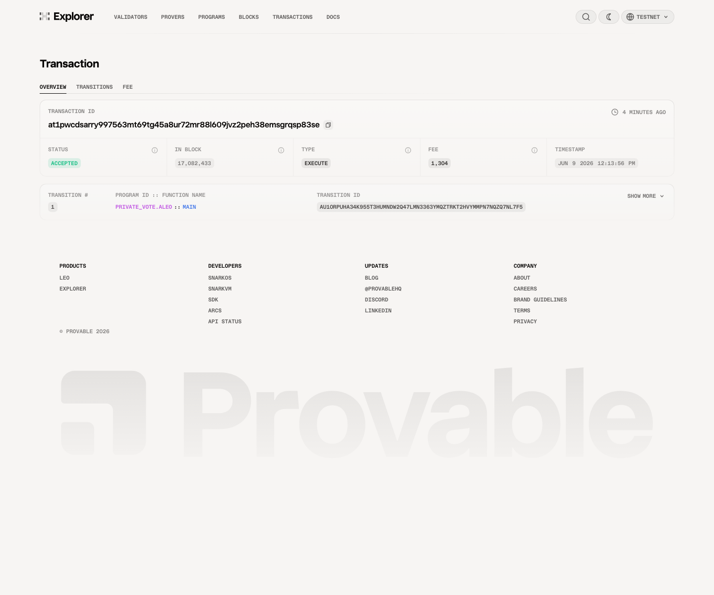

# Task 4 - 用起来：真实场景落地

## 测试网合约

- Program ID：`private_vote.aleo`
- 部署交易：`at18jhvcs9gnjwhnqhzgu6sl5mkuyqc9vgt8h5et8sxh98udyg70vpqdyg87a`
- 部署链接：https://testnet.explorer.provable.com/transaction/at18jhvcs9gnjwhnqhzgu6sl5mkuyqc9vgt8h5et8sxh98udyg70vpqdyg87a

## 链上交互

- 调用函数：`main`
- 输入参数：`3u64 2u64`
- 本地明文输出：`true`
- 交互交易：`at1pwcdsarry997563mt69tg45a8ur72mr88l609jvz2peh38emsgrqsp83se`
- 交互链接：https://testnet.explorer.provable.com/transaction/at1pwcdsarry997563mt69tg45a8ur72mr88l609jvz2peh38emsgrqsp83se

## 说明

Explorer 中展示的是私有 boolean 输出的 ciphertext；本地 Leo CLI 可以看到明文返回值 `true`。

## 链上交互截图

