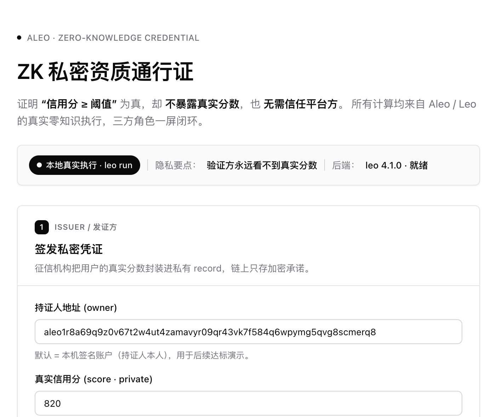
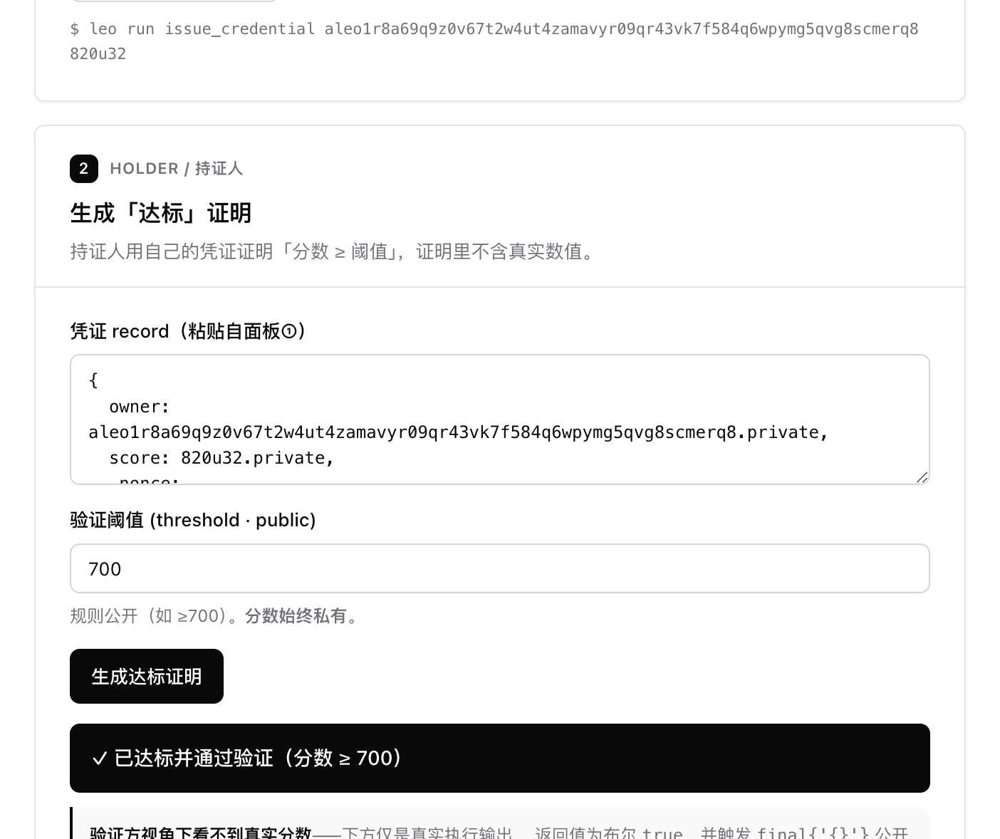
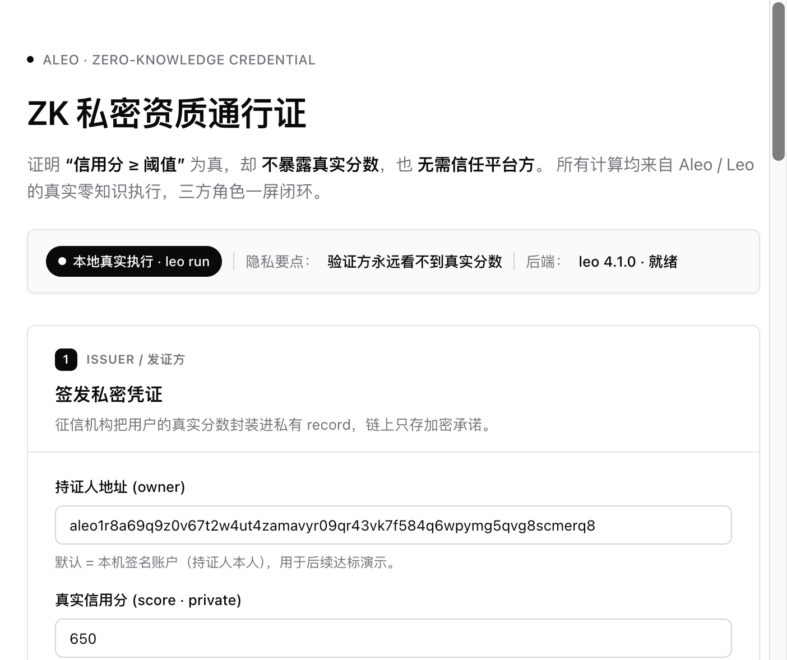
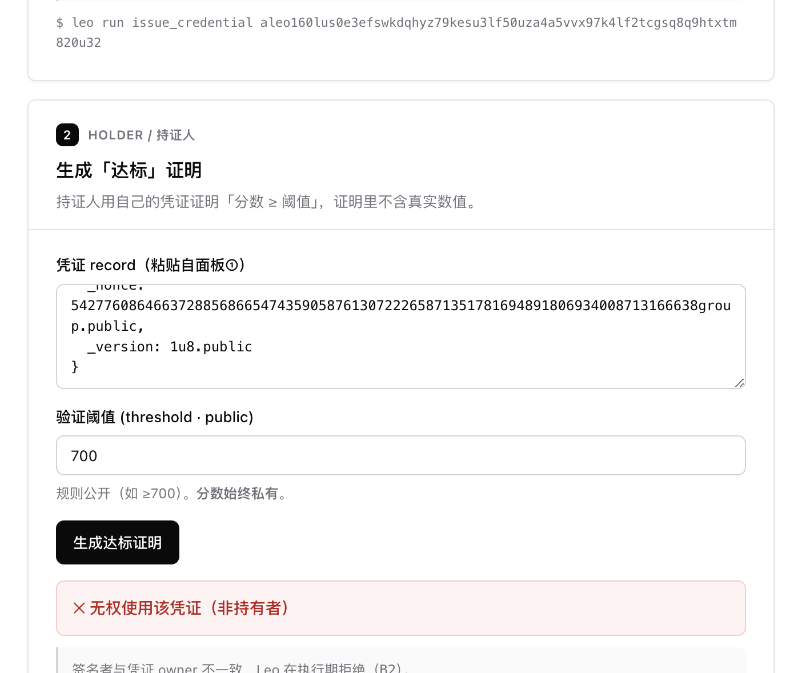

# Task 3 - 建起来：从程序到 dApp

## 项目名称

**ZK 私密资质通行证（ZK Private Credential Pass）** —— 一个"证明达标、但不暴露真实数值、且无需信任平台方"的隐私验证 dApp。

> 场景示例：某平台要求"信用分 ≥ 700"才能开通服务。用户想证明自己达标，却**不想把真实信用分（例如 820）告诉平台**。本应用用 Aleo/Leo 让用户**只证明"≥700 为真"，平台拿不到任何具体数值，也无需信任任何第三方中介**。

---

## 一、需求背景：为什么需要它？

### 现实中的痛点

我们每天都在"为了证明一件事，被迫交出远超必要的信息"：

- 进酒吧证明满 18 岁 → 掏出身份证，结果**生日、住址、证件号全被看光**。
- 申请贷款证明"信用达标" → 交出完整征信报告，**精确分数、历史记录全暴露**。
- 证明"我是某社区/白名单成员" → 暴露了**具体身份**。

问题的本质是：**"证明一个事实"** 和 **"暴露原始数据"** 被强行绑定在了一起。

### 现有方案为什么不够

| 方案 | 做法 | 问题 |
|------|------|------|
| 直接出示原始数据 | 把信用分/生日/流水交给平台 | 信息泄露，平台可滥用、可被拖库 |
| 信任中心化中介托管 | 找一个双方都信的第三方代为核验 | **必须信任这个中介**；中介本身成为单点风险与数据黑洞 |

也就是说：**"既藏住原始数据、又不必信任任何第三方、还能让对方相信结论"——传统方案做不到。**

---

## 二、解决方案：为什么用 Aleo？

Aleo 是隐私优先的 L1，零知识证明是其原生能力。它恰好能同时满足上面三个看似矛盾的要求：

1. **Private by default（默认隐私）**：用户的真实数值放在私有 `record` 里，链上以加密承诺存在，**任何人（包括验证方）都看不到明文**。
2. **零知识证明**：用户可以在本地生成一个证明，数学上证明"私有数值 ≥ 公开阈值"为真，**证明里不包含原始数值**。
3. **无需信任第三方**：验证由密码学和链上验证保证，**不依赖任何中心化中介**——这正是中心化方案（如让某平台/某中介替你保密）无法替代的核心价值。

> 一句话：**中心化方案能"藏数据"，但前提是你信任它；Aleo 能在"谁都不信任"的前提下，依然让对方相信一个关于你私密数据的结论。** 这是 zk 唯一不可替代的价值，也是本应用必须用 Aleo 的根本原因。

---

## 三、用户故事

参与方：**发证方（Issuer，如征信机构）**、**持证人（Holder，普通用户）**、**验证方（Verifier，平台）**。

### Story 1：发证方签发私密凭证
> 作为**征信机构**，我为用户小明签发一张资质凭证：里面装着他的真实信用分 `820`。
> 这张凭证以**私有 record** 形式归小明所有，加密上链，**链上谁都看不到 820 这个数**。

### Story 2：持证人生成"达标"证明（不暴露真实值）
> 作为**持证人小明**，我想开通一个要求"信用分 ≥ 700"的服务。
> 我用自己的凭证 record 在本地生成一个零知识证明：**"我的分数 ≥ 700"**。
> 这个证明**只表达"达标"，不包含 820**。

### Story 3：验证方核验 + 公开计数
> 作为**平台（验证方）**，我收到小明的证明，确认其**信用分确实 ≥ 700**，于是放行。
> 全过程我**没拿到他的真实分数**，也**没依赖任何中介**。
> 同时，链上一个**公开计数器（mapping）** 记录"已通过验证的总人数 +1"——聚合数据公开透明，个人隐私完全保密。

---

## 四、用户流程（App 交互设计）

> 说明：用户故事讲的是"为什么这么做"，用户流程讲的是"在我们这个 App 上具体点哪、出什么、各分支怎么走"。
> 本流程按 **L1（本地真实执行 `leo run`）** 设计：所有关键操作都由后端真实调用 `leo run <function> <inputs>`，**真实生成零知识证明、真实执行 `final {}` 逻辑**并把输出回显前端。
> （部署上链、跨次状态持久化属于 **Task 4** 的范围，见文末"目标与行动计划"。）

### 4.0 App 形态

单页应用，从上到下三个面板对应三方角色，外加一个全局说明栏：

```text
┌───────────────────────────────────────────────────────────┐
│  顶部 · 状态/说明栏                                          │
│  · 执行模式：本地真实执行（leo run）                        │
│  · 隐私要点：验证方永远看不到真实数值                       │
├───────────────────────────────────────────────────────────┤
│  面板 ①  发证方 Issuer（征信机构）                          │
│  面板 ②  持证人 Holder（用户本人）                          │
│  面板 ③  验证方 Verifier（平台）                            │
└───────────────────────────────────────────────────────────┘
```

> 注：现实中三方是独立系统，这里同页是为了让评审一次看完完整闭环；每个面板顶部标注当前操作的"身份视角"。

### 4.1 主流程（Happy Path：达标并通过）

| 步骤 | 用户操作（点什么） | 系统行为（真实执行什么） | 界面反馈（看到什么） |
|------|-------------------|------------------------|---------------------|
| S1 | 面板①：填入持证人地址 + 真实信用分（如 `820`），点【签发凭证】 | 后端调 `leo run issue_credential <addr> 820u32`；真实产出**私有 Credential record** | 展示返回的 record（`score` 字段标注 `.private`），提示"真实分数已加密、不会明文出现在链上" |
| S2 | 面板②：粘入上一步拿到的 Credential record，设定阈值（默认 `700`），点【生成达标证明】 | 后端调 `leo run verify_threshold "<record>" 700u32`；真实断言 `score >= 700`、执行 `final {}` 中公开计数 +1 的逻辑、生成证明 | 展示"✅ 已达标并通过验证" + **真实执行输出**（含 `finalize` 逻辑）；明确标注"验证方视角下看不到 820" |
| S3 | 面板③：查看本次验证结果 | 读取 S2 的执行结果 | 显示"该用户已通过（不含具体分数）"，并展示本次执行中 `final {}` 对公开计数的更新逻辑 |

> 隐私要点贯穿全程：面板③（验证方视角）从头到尾**只能看到"通过/未通过"，永远看不到 820**。

### 4.2 关键分支（这是体现"不 low"的地方）

**分支 B1：未达标（score < threshold）**
> 持证人用 `score=650` 的凭证去证明"≥700"。
> → `leo run` 执行时 `assert(score >= threshold)` 失败，执行报错。
> → 界面显示"❌ 未达标，验证未通过"，且**依然不泄露 650 具体是多少**（只知道"没到 700"）。

**分支 B2：非本人盗用凭证**
> 非 owner 的账户拿别人的 Credential record 去验证。
> → `assert_eq(self.signer, credential.owner)` 失败，执行报错。
> → 界面显示"❌ 无权使用该凭证（非持有者）"。

**分支 B3（设计内置，演示属 Task 4）：防重放**
> 合约内置 nullifier 防重放逻辑（`used: field => bool` mapping + `assert(!used[nullifier])`），用于防止"同一凭证对同一门槛重复使用"。
> → 在 L1（`leo run`）下，公开 mapping 状态**不跨次持久化**，因此"第二次被拒"的**真实累积效果无法 live 演示**；本阶段作为**代码与逻辑展示**保留。
> → **真实 live 演示需部署上链（Task 4）**，届时此分支可完整复现。

### 4.3 阈值/场景可替换说明

阈值故事默认"信用分 ≥ 700"，逻辑对"年龄 ≥ 18""余额 ≥ X"完全通用——只需改 record 字段名与默认阈值，Leo 断言逻辑不变。

---

## 五、技术文档

### 5.1 整体架构

```text
┌─────────────┐    HTTP     ┌──────────────────┐   shell    ┌─────────────────┐
│   前端 (UI)  │ ─────────▶  │  Node 后端 (API) │ ─────────▶ │   Leo CLI       │
│ 三方交互界面 │ ◀─────────  │  封装 leo 命令    │ ◀───────── │ leo run/execute │
└─────────────┘   JSON      └──────────────────┘   stdout   └─────────────────┘
                                                                     │
                                                              真实零知识执行
                                                          （私有 record + 公开 mapping）
```

- **前端**：纯静态页面（HTML/CSS/JS），三个区块对应发证 / 出证 / 验证三方流程，展示真实执行输出。
- **后端**：轻量 Node (Express) 服务，把前端请求翻译成 `leo run <function> <inputs>`，真实执行并把 stdout（含 record、输出、finalize 逻辑）返回前端。**不做任何业务计算，确保"真实执行"而非 JS 模拟。**
- **Leo 程序**：核心隐私逻辑，私有 record + 公开 mapping。

> 说明：Aleo 的 mapping（公开状态）只有在真实链/devnet 上才会跨调用持久化。本项目用 `leo run` 做真实执行演示，`final` 块逻辑会被真实执行并体现在输出中；"已验证人数"计数器作为公开状态的**逻辑演示**（完整持久化可通过 `leo deploy` 到 testnet/devnet 实现）。

### 5.2 Leo 程序设计（`credential_pass.aleo`）

数据结构与函数（最终代码以实现为准）：

```leo
program credential_pass.aleo {
    // 私有凭证：真实数值（如信用分）仅持证人可见
    record Credential {
        owner: address,
        score: u32,        // 私有：真实数值，链上不可见
    }

    // 公开状态：已通过验证的累计人数
    mapping verified_count: u8 => u32;

    @noupgrade
    constructor() {}

    // 1) 发证方签发私密凭证
    fn issue(owner: address, score: u32) -> Credential { ... }

    // 2) 持证人生成"达标"证明 + 公开计数 +1
    //    断言 score >= threshold；threshold 公开，score 私有
    fn prove_threshold(cred: Credential, public threshold: u32) -> (bool, Final) { ... }
}
```

设计要点：
- `Credential.score` 为 **private**，体现"真实数值不上链"。
- `prove_threshold` 中 `threshold` 为 **public**（验证规则公开），`score` 保持私有，断言 `score >= threshold`。
- `final {}` 块更新公开 mapping `verified_count`，体现"聚合数据公开、个体隐私保密"。

### 5.3 后端 API 设计

| 方法 | 路径 | 入参 | 说明 |
|------|------|------|------|
| GET  | `/health` | — | 检查后端与 Leo 项目路径是否就绪 |
| POST | `/api/issue` | `{ owner, score }` | 调 `leo run issue ...`，返回签发的 Credential record |
| POST | `/api/prove` | `{ credential, threshold }` | 调 `leo run prove_threshold ...`，返回是否达标 + 执行输出 |

返回体统一格式：
```json
{ "ok": true, "stdout": "...", "result": "...", "stderr": "" }
```

### 5.4 前端交互设计

单页三区块，对应三方角色：
1. **发证方面板**：输入地址 + 真实分数 → 签发凭证（展示返回的私有 record）。
2. **持证人/验证面板**：填入凭证 + 阈值 → 生成证明（展示"✅ 达标 / ❌ 未达标"与真实执行输出，但**不显示真实分数给验证方视角**）。
3. **状态展示**：突出"验证方看不到真实分数"这一隐私要点，并展示公开计数逻辑。

### 5.4.1 页面设计风格标准（务必遵守）

整体追求 **shadcn/ui 经典黑白风格**：高级、精致、细致、克制。**不要**花哨渐变、彩色霓虹、毛玻璃、emoji 堆砌等"廉价感"元素。

**实现方式（二选一）：**
- 优先：直接用 **shadcn/ui（React + Vite + Tailwind）**，采用默认 `neutral`/`zinc` 基色与 "new-york" 风格组件。
- 或：用**原生 HTML/CSS 复刻** shadcn 设计语言（按下方 token 手写），保持 2 小时可控。两种都可，视实现者熟练度选择。

**设计 Token（黑白中性）：**
- 背景 `#ffffff`；前景文字近黑 `#0a0a0a`；次级文字 `#71717a`（zinc-500）。
- 边框/分隔线极浅灰 `#e4e4e7`（zinc-200）；卡片/输入框背景白或 `#fafafa`。
- 主按钮：黑底白字（`bg #0a0a0a` / `text #fff`），hover 略微提亮；次按钮：白底黑字 + 浅边框（outline/ghost）。
- 圆角 `--radius: 0.5rem`（卡片/按钮/输入一致）；阴影克制（`shadow-sm`，避免厚重投影）。
- 字体：`Inter` / `Geist` / 系统 `-apple-system`；标题字重 600，正文 400–500，行高舒展。
- 间距：留白充足（卡片内边距 `24px`、区块间距 `16–24px`）；信息分组清晰。

**组件与质感：**
- 三方面板用 **Card**（标题 + 描述 + 内容区），每张卡顶部标注身份视角（如 "Issuer / 发证方"）。
- 输入用 shadcn `Input` 风格（细边框、聚焦时黑色 ring）；按钮用 `Button` 风格。
- 状态用 **Badge**（达标=黑底/通过、未达标=描边红、防重放=描边灰）；执行输出用等宽字体的 `code` 区块（浅灰底）。
- 过渡动效轻微（`transition` 150–200ms），不喧宾夺主。
- 注重细节：对齐、像素级间距一致、空状态/加载态/错误态都要有，体现"精致细致"。

### 5.5 目录结构

```text
learn/renyuantime/task3/
├── task3.md                     # 本文档（PRD + 技术设计）
├── credential_pass/             # Leo 程序
│   ├── program.json
│   └── src/main.leo
├── backend/
│   └── server.js                # Node + Express，封装 leo 命令
├── web/
│   └── index.html               # 三方交互前端
└── screenshots/                 # demo 截图
```

### 5.6 本地运行步骤

> 环境：macOS（Apple Silicon M4 / ARM64），Leo 4.1.0，Node v22+。
> 更详细的一键启动说明见同目录 `README.md`。

```bash
cd learn/renyuantime/task3

# ── 0) 安装 Leo CLI（若未安装）──────────────────────────────
# 方式一：cargo（需先装 Rust）
cargo install leo-lang
# 方式二：直接下载 Apple Silicon 预编译二进制（本项目采用）
#   https://github.com/ProvableHQ/leo/releases  → leo-lang-v4.1.0-aarch64-apple-darwin.zip
leo --version          # 期望输出 leo 4.1.0

# ── 1) 编译 + 本地真实执行 Leo 程序 ─────────────────────────
cd credential_pass
# 首次需要一个本机账户（self.signer 由此私钥决定），已写入 .env
leo account new --seed 1 --write

# 设本机地址 SELF=aleo1r8a69q9z0v67t2w4ut4zamavyr09qr43vk7f584q6wpymg5qvg8scmerq8
# (1) 发证方签发私密凭证（真实分数 820 进入私有 record）
leo run issue_credential aleo1r8a69q9z0v67t2w4ut4zamavyr09qr43vk7f584q6wpymg5qvg8scmerq8 820u32
# (2) 持证人证明「分数 ≥ 700」——把上一步输出的 record 整体作为入参
leo run verify_threshold "{ owner: aleo1r8a...scmerq8.private, score: 820u32.private, _nonce: ...group.public, _version: 1u8.public }" 700u32
#   → 达标：输出 true + final（公开计数 +1）
#   → 把 820 换成 650 再验证 700：assert 失败（B1 未达标）
#   → 把凭证签发给别的地址、再用本机签名验证：执行期拒绝（B2 非本人）

# ── 2) 启动后端（真实调用 leo run，无 JS 模拟）──────────────
cd ../backend
npm install
node server.js        # 监听 http://localhost:3001

# ── 3) 启动前端（静态页）────────────────────────────────────
cd ../web
python3 -m http.server 8080
# 浏览器打开 http://localhost:8080/index.html
```

接口自测：

```bash
curl http://localhost:3001/health
curl -X POST http://localhost:3001/api/issue \
  -H 'Content-Type: application/json' \
  -d '{"owner":"aleo1r8a69q9z0v67t2w4ut4zamavyr09qr43vk7f584q6wpymg5qvg8scmerq8","score":820}'
curl -X POST http://localhost:3001/api/verify \
  -H 'Content-Type: application/json' \
  -d '{"credential":"<上一步返回的 record>","threshold":700}'
```

---

## 六、Demo 截图

所有截图均为前端真实联调 + 后端真实调用 `leo run` 的结果（无任何 JS 伪造计算）。

### 6.1 发证方签发私密凭证

发证方填入持证人地址与真实信用分 `820`，调用 `leo run issue_credential`，返回私有 `Credential` record；`score` 字段标注 `.private`，明文不上链。



### 6.2 主流程：达标并通过（820 ≥ 700）

持证人用凭证生成「达标」证明，`leo run verify_threshold` 真实返回 `true` 并触发 `final {}` 公开计数 +1；验证方面板（视角③）只显示「已通过」与公开计数，**真实分数全程不可见**。



### 6.3 分支 B1：未达标（650 ≥ 700 失败）

把分数换成 `650` 再证明「≥700」，Leo 执行期 `assert(score >= threshold)` 失败；界面显示「未达标，验证未通过」，且**依然不泄露 650 具体是多少**。



### 6.4 分支 B2：非本人盗用凭证

非 owner 账户拿别人的凭证验证，Leo 在执行授权阶段拒绝（`Input record must belong to the signer`）；界面显示「无权使用该凭证（非持有者）」。



---

## 七、目标与行动计划（交接给执行 AI）

> 本节是给在 Linux 服务器上接手实现的 AI 看的执行说明。读完应能**无需再问、直接开干**。

### 7.1 本次目标（Task 3 范围 = L1）

交付一个**本地真实执行**的隐私资质验证 dApp：

- Leo 程序真实可编译、可 `leo run` 执行（私有 record + 公开 mapping，真正用上隐私模型）。
- Node 后端真实调用 `leo run`（**不得用 JS 模拟计算**）。
- 单页三面板前端（发证 / 出证 / 验证），能跑通主流程与分支。
- 截图 + 补全文档运行步骤。

**明确不在本次范围（属 Task 4）**：部署上链（`leo deploy`/`execute --broadcast`）、公共测试网、防重放的 live 持久化演示、钱包接入。这些只需在代码里"逻辑写好、可部署"，不要求本次跑通。

### 7.2 验收标准（Definition of Done）

1. `cd credential_pass && leo run issue_credential <addr> 820u32` 成功产出私有 Credential record。
2. `leo run verify_threshold "<record>" 700u32` 达标返回成功并执行 `final` 逻辑；`...650u32...700u32` 未达标时 assert 失败。
3. 后端 `/health`、`/api/issue`、`/api/verify` 三个接口可用，真实回显 `leo run` 的 stdout。
4. 前端三面板可操作，主流程 + B1（未达标）+ B2（非本人）可演示。
5. `screenshots/` 内有不少于 3 张截图；本文档 5.6 运行步骤与 6 截图补全。

### 7.3 实现步骤（按顺序执行）

1. **环境**：开发机为 **macOS（Apple Silicon M4 / ARM64）**，Leo 官方支持，无需特殊处理。安装 Leo CLI 并确认可用（目标 Leo 4.x；语法用 `fn` / `final {}`，不要用旧的 `transition`）：

   ```bash
   # 方式一：官方安装脚本（推荐）
   curl -L https://raw.githubusercontent.com/ProvableHQ/leo/mainnet/leo_install.sh | sh
   # 方式二：Homebrew
   brew install leo
   # 验证
   leo --version
   ```
   Node 已具备（v22）。M4 性能充足，`leo run` 证明生成会很快。
2. **Leo 程序** `credential_pass/`：
   - `leo new credential_pass` 初始化，编辑 `src/main.leo`。
   - 定义 `record Credential { owner: address, score: u32 }`。
   - 定义公开 `mapping verified_count: u8 => u32;`，并预留 `mapping used: field => bool;`（防重放，逻辑写好即可）。
   - `issue_credential(receiver, score) -> Credential`：产出私有凭证（可选 `final` 中校验 admin）。
   - `verify_threshold(cred: Credential, public threshold: u32) -> (bool, Final)`：
     - 校验 `assert_eq(self.signer, cred.owner)`（B2 分支）。
     - 计算 nullifier（如 `cred.owner as field + threshold as field`），`final {}` 中 `assert(!used.get_or_use(n,false))`、`used.set(n,true)`、`verified_count` +1（B3 防重放逻辑，L1 不要求 live）。
     - 返回 `cred.score >= threshold`。
   - `leo run` 跑通 7.2 中的三种用例。
3. **后端** `backend/server.js`：Node + Express，`execFile("leo", ["run", fn, ...inputs], { cwd: 程序目录 })`，封装 `/health`、`/api/issue`、`/api/verify`，统一返回 `{ ok, stdout, result, stderr }`。处理 assert 失败（非零退出码）为"未通过"而非 500。
4. **前端** `web/`：单页三面板（见第四节）。**严格遵守 5.4.1 的 shadcn 经典黑白设计风格**（高级、精致、细致；优先 shadcn/ui，或用原生 CSS 复刻其设计语言）。突出"验证方看不到真实分数"的隐私要点；展示真实 `leo run` 输出。
5. **联调 + 截图**：跑通主流程与 B1/B2，截图存 `screenshots/`，补全本文档 5.6 与第六节。
6. **（可选拉伸）** 若时间充裕，按 Task 4 方向把部署/上链脚本与说明补上，但不影响本次验收。

### 7.4 给执行 AI 的约束

- **真实执行优先**：任何计算结果必须来自 `leo run` 真实输出，禁止前端/后端用 JS 伪造。
- **隐私叙事是灵魂**：UI 与文案要反复强调"证明达标、但不暴露真实数值、且无需信任平台方"。
- **遇到 Leo 语法/版本问题**：以 `leo --version` 实际版本与官方文档为准，必要时简化字段而非卡死。
- 目录结构遵循第 5.5 节。

### 7.5 参考实现与 Leo 语法避坑（重要）

**本仓库已有一份语法完全正确的 Leo 4.0 范例，强烈建议先读它再动手：**

- `learn/Maimai10808/task3_demo/zk-airdrop-claim/programs/zk_airdrop_claim/src/main.leo`
  —— 完整展示了 4.0 的：`record`、`mapping`、`@noupgrade constructor()`、`fn ... -> (Record, Final)`、`return final { ... }`、`assert`/`assert_eq`、`mapping.get_or_use/contains/set`、helper `fn`、record 字段不能直接在 `final` 块里用（要先取成普通变量）等关键写法。
- 后端封装可参考：`learn/Maimai10808/.../frontend/src/services/server/leoCli.ts`（用 `execFile("leo", [...])` 调 CLI 的范式；我们用 `leo run` 即可，不需要 `execute --broadcast`）。
- 同样采用"本地执行、部署留 Task 4"思路的同类提交：`learn/truongvknnlthao-gif/task3/`（`leo build` + `leo test` + 前端）。

**Leo 4.x 关键避坑点：**
1. 用 `fn` 与 `final {}`，**不要**用旧版 `transition` / `then finalize`（那是 3.x，已过时）。
2. 公开可变状态（计数、nullifier 标记）必须放在 `mapping` 里，且**只能在 `final {}` 块内读写**。
3. `record` 类型的变量**不能直接进 `final` 块**，需先在入口函数体里提取成普通变量（如 `let s: u32 = cred.score;`）再传入 `final`。
4. 字面量要带类型后缀：`820u32`、`700u32`、`0u8` 等。
5. 入口函数若要改公开状态，签名返回 `(... , Final)` 并 `return (..., final { ... });`。
6. 先 `leo run` 跑通三种用例（达标/未达标/非本人）再接前后端，避免在集成阶段才发现 Leo 报错。
