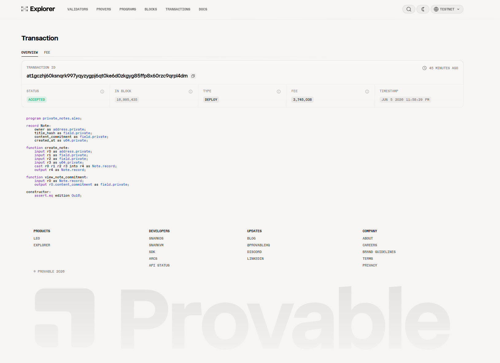
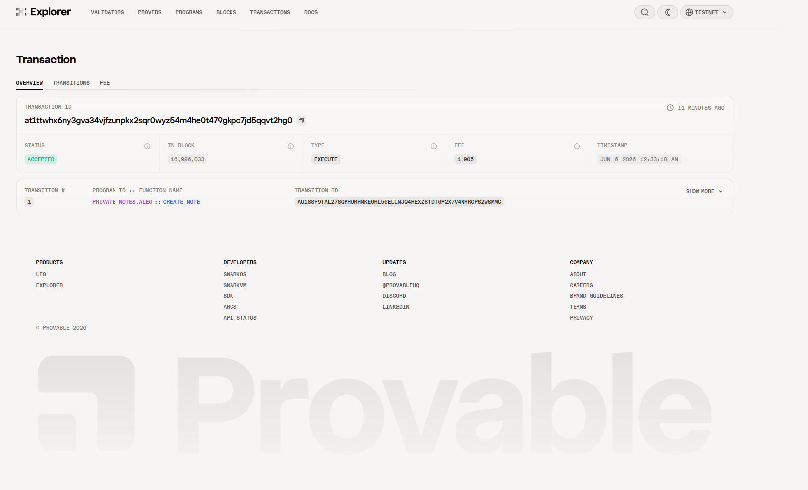

# Task 4 - 用起来：真实场景落地

## 提交信息

- **GitHub 用户名**: xiaohgtx
- **日期**: 2026-06-05

---

## 1. 部署的合约

### 合约名称
`private_notes.aleo`

### 合约源码
```leo
// Private Notes 隐私笔记应用
// 这个程序演示：私密笔记内容不直接上链，只把前端生成的承诺值写进私有 record。
program private_notes.aleo {
    // 笔记记录，存储在链上但内容不公开
    record Note {
        // owner 表示这个 record 归哪个 Aleo 地址控制
        owner: address,
        // title_hash 是笔记标题的哈希形式，避免直接把完整标题写入 record
        title_hash: field,
        // content_commitment 是笔记内容生成的承诺值，不包含原始笔记内容
        content_commitment: field,
        // created_at 用来演示业务字段，前端传入 Unix 时间戳
        created_at: u64,
    }

    // 构造函数：部署时执行一次，@noupgrade 表示合约不可升级
    @noupgrade
    constructor() {}

    // 创建新笔记的 function
    fn create_note(
        owner: address,
        title_hash: field,
        content_commitment: field,
        created_at: u64,
    ) -> Note {
        // function 返回的新 Note 是私有 record，后续只有 owner 能消费
        return Note {
            owner,
            title_hash,
            content_commitment,
            created_at,
        };
    }

    // 查看笔记承诺值的 function（不暴露原始内容）
    fn view_note_commitment(note: Note) -> field {
        // 这里不会揭示原始笔记内容，只返回承诺值用于外部核对
        return note.content_commitment;
    }
}
```

### 部署交易 ID
```
at1gczhj60ksnqrk997yqyzygpj6qt0ke6d0zkgyg85ffp8x60rzc9qrpl4dm
```

### 部署者地址
```
aleo18kvx4atvn22j6qrnt8efhzskp5lhk3re0c0ewnp9z3a9tmcreyrsszx2cd
```

### 测试网部署确认
- **交易状态**: ✅ 已确认（confirmed）
- **消耗费用**: 3.745038 credits
- **共识版本**: ConsensusVersion 15

---

## 2. 链上交互

### 交互功能
调用了 `create_note` 函数，创建一条隐私笔记记录

### 调用参数
| 参数 | 值 |
|------|-----|
| owner | `aleo18kvx4atvn22j6qrnt8efhzskp5lhk3re0c0ewnp9z3a9tmcreyrsszx2cd` |
| title_hash | `123456789field` |
| content_commitment | `987654321field` |
| created_at | `1717555200u64` |

### 链上交互交易 ID
```
at1ttwhx6ny3gva34vjfzunpkx2sqr0wyz54m4he0t479gkpc7jd5qqvt2hg0
```

### 交互详情
- **调用函数**: `create_note`
- **执行费用**: 0.001905 credits
- **交易状态**: ✅ 已确认（3 个区块确认）
- **输出**: 一条私有 `Note` record（包含 owner, title_hash, content_commitment, created_at）

### 验证
可在 Provable Explorer 查看交易详情：
```
https://api.explorer.provable.com/v1/testnet/transaction/at1ttwhx6ny3gva34vjfzunpkx2sqr0wyz54m4he0t479gkpc7jd5qqvt2hg0
```

---

## 3. 项目结构

```
learn/xiaohgtx/task3_demo/
├── src/main.leo          # Leo 合约源码
├── program.json          # 项目配置
├── .env                  # 部署配置（不含助记词/私钥）
├── frontend/             # 前端 dApp 界面
│   ├── src/App.jsx       # React 主界面
│   ├── src/workers/      # Aleo SDK Worker
│   └── package.json      # 前端依赖
└── README.md             # 项目说明
```

---

## 4. 部署和交互截图

### 部署交易确认


### 链上交互交易确认


---

## 5. 说明

1. 本项目是一个**隐私笔记（Private Notes）**应用，使用 Aleo 零知识证明技术保证笔记内容不上链
2. 笔记标题和内容通过哈希/承诺值存储在链上 record 中，原始内容仅在前端本地保存
3. 部署到 Aleo 测试网（testnet），使用 Leo 4.2.0 编译器
4. 合约包含 `@noupgrade constructor()` 以满足测试网 ConsensusVersion V9 要求