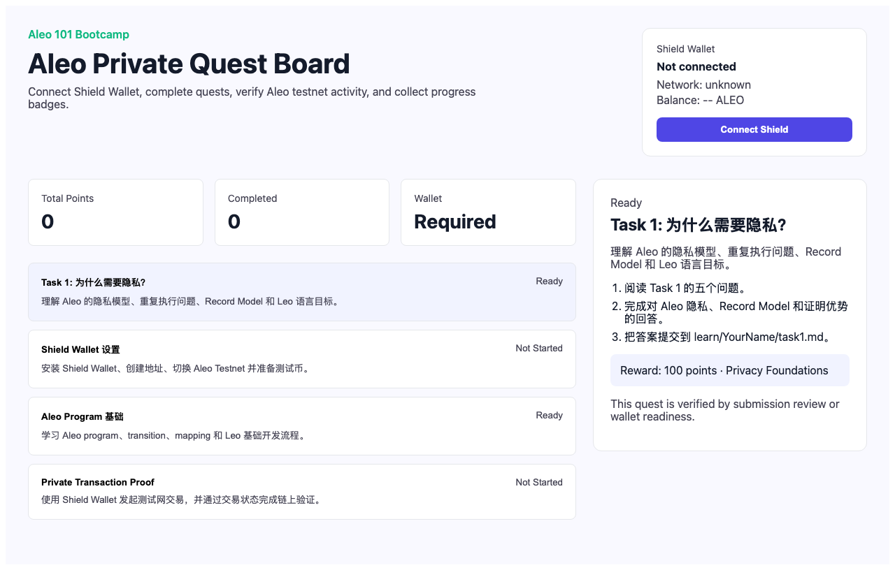
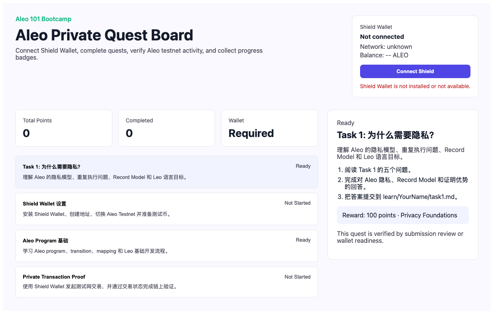
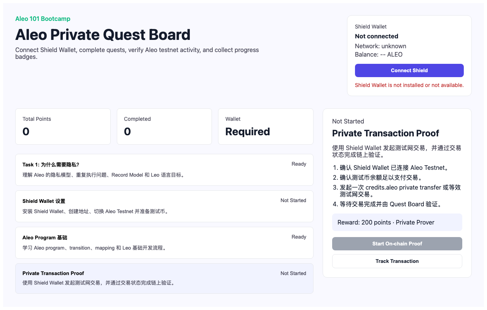

# Task 3 - Build It: From Program to dApp

## Aleo Private Quest Board

An interactive privacy dApp built for the Aleo 101 Bootcamp course. This application demonstrates the integration of Aleo blockchain technology with a modern web frontend, showcasing zero-knowledge proof concepts through a quest-based learning system.

### Project Overview

The Aleo Private Quest Board is a decentralized application that allows learners to complete privacy-focused quests, connect with Shield Wallet, and verify on-chain activity on the Aleo testnet.

**Live Demo:** https://aleo-quest-board.vercel.app/quest-board

### Features

- **Shield Wallet Integration** - Connect to Aleo testnet using the official Shield Wallet browser extension
- **4 Privacy Quests** - Complete tasks covering privacy foundations, wallet setup, program basics, and private transactions
- **On-chain Verification** - Verify transaction completion directly on the Aleo blockchain
- **Points & Badges System** - Earn points and collect badges for completed quests
- **Progress Persistence** - Local storage saves your quest progress

### Tech Stack

- **Frontend:** Next.js 13, React 18, TypeScript
- **Wallet:** Shield Wallet Adapter (browser extension API)
- **Blockchain:** Aleo Testnet (transaction verification via explorer API)
- **Testing:** Vitest + Playwright

### Screenshots


*Quest Board with 4 privacy quests displayed*


*Shield Wallet connected showing address, network, and balance*


*Transaction quest with on-chain verification workflow*

### Project Structure

```
aleo-quest-board/
├── pages/
│   └── quest-board.tsx      # Main quest board page
├── quest-board/
│   ├── catalog.ts           # Quest definitions (4 bootcamp quests)
│   ├── progress.ts          # Quest state machine
│   ├── types.ts             # Shared TypeScript types
│   ├── styles.ts            # UI design tokens
│   ├── useQuestBoard.ts     # React hook for state management
│   ├── chain/               # Aleo blockchain service
│   └── wallet/              # Wallet adapters (Shield, Mock)
└── vitest.config.ts
```

### Running the Project

```bash
# Install dependencies
npm install

# Start development server
npm run dev

# Run tests
npm run test

# Type check
npm run typecheck

# Build for production
npm run build
```

### Quest Categories

| Quest | Description | Points | Verification |
|-------|-------------|--------|--------------|
| Privacy Foundations | Understanding Aleo's privacy model | 100 | Manual submission |
| Shield Wallet Setup | Install and configure Shield Wallet | 120 | Wallet connection |
| Aleo Program Basics | Learn Leo programming basics | 140 | Manual submission |
| Private Transaction Proof | Execute on-chain private transaction | 200 | Transaction verification |

### Wallet Connection

The application integrates with the official Aleo Shield Wallet browser extension.

For production, users must:
1. Install [Shield Wallet](https://www.shieldwallet.io/)
2. Create an Aleo account
3. Switch to Testnet
4. Get test tokens from the Aleo faucet
